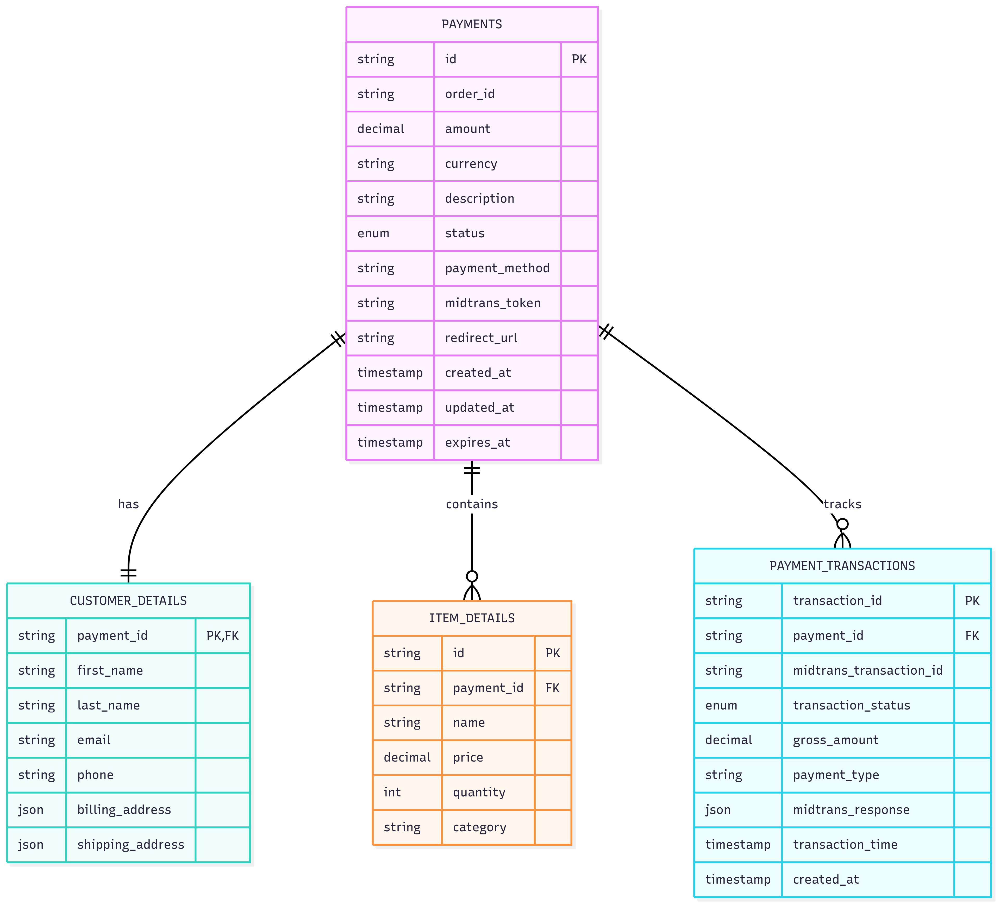
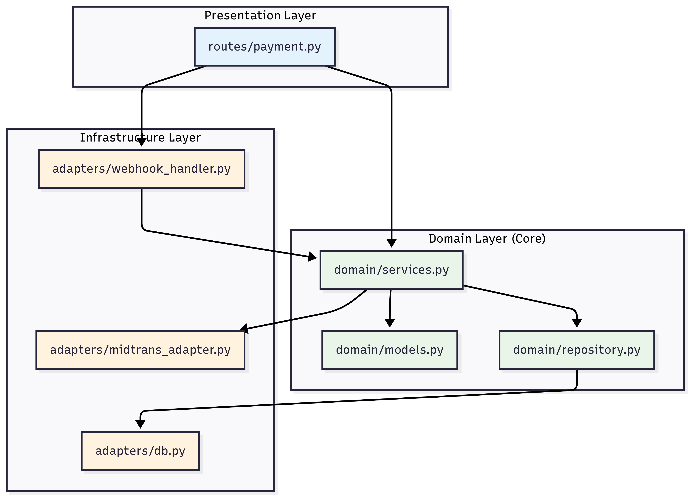
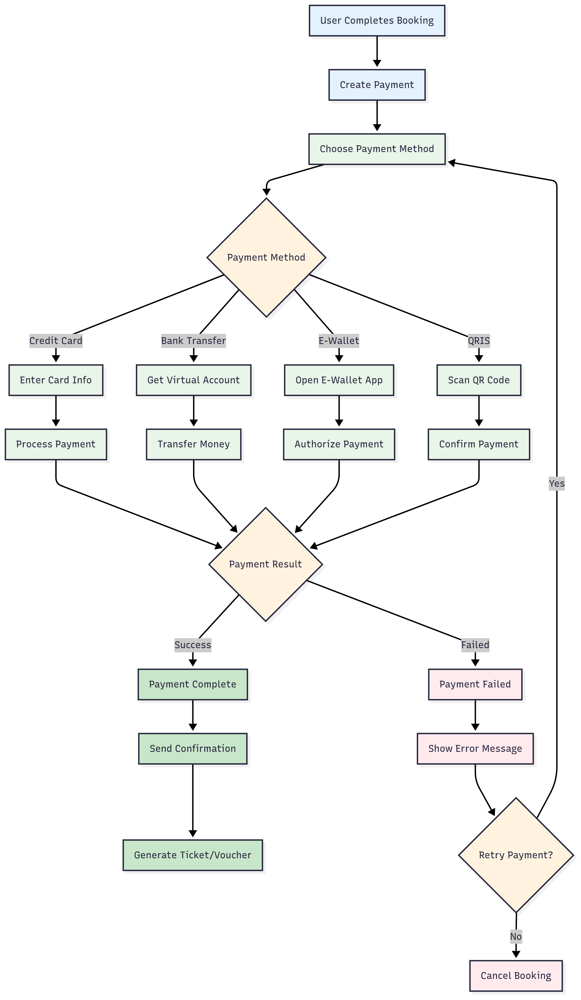

# TiketQ Payment Service

Microservice untuk menangani pembayaran pada platform TiketQ menggunakan FastAPI dan Midtrans sebagai payment gateway.



## 🏗️ Arsitektur

Service ini menggunakan **Hexagonal Architecture (Ports & Adapters)** dengan struktur:

```
payment-service/
├── app.py                    # FastAPI application
├── domain/                   # Core business logic
│   ├── models.py            # Domain entities
│   ├── services.py          # Business services
│   └── repository.py        # Repository ports
├── adapters/                # External adapters
│   ├── midtrans_adapter.py  # Midtrans payment adapter
│   ├── db.py               # Database adapter
│   └── webhook_handler.py  # Webhook adapter
└── routes/                  # HTTP ports
    └── payment.py          # Payment REST API
```



### Hexagonal Pattern Components:

- **Core (Domain)** - Business logic dan entities
- **Ports** - Interfaces untuk komunikasi external
- **Adapters** - Implementasi konkret untuk external systems

## 🔄 Payment Flow



Payment service menangani proses pembayaran dengan flow:

1. **Create Payment** - Membuat transaksi melalui Midtrans
2. **Payment Processing** - User melakukan pembayaran
3. **Webhook Notification** - Midtrans mengirim notifikasi status
4. **Status Update** - Update status di database shared

## 🚀 Fitur Utama

- ✅ **Integrasi Midtrans** - Support berbagai payment methods
- ✅ **Webhook Handler** - Real-time payment status updates
- ✅ **Shared Database** - PostgreSQL dengan tabel terpisah per service
- ✅ **Auto Status Sync** - Sinkronisasi otomatis dengan Midtrans
- ✅ **Hexagonal Architecture** - Struktur yang loosely coupled

### Payment Methods Support

- 💳 Credit Card
- 🏦 Bank Transfer (BCA, Mandiri, BNI, BRI)
- 📱 E-Wallet (GoPay, OVO, DANA)
- 📋 QRIS
- 🏪 Retail (Indomaret, Alfamart)

## 🛠️ Quick Start

### Menggunakan Docker Compose

```bash
# Clone repository
git clone <repository-url>
cd payment-fastapi

# Setup secrets (create secrets directory)
mkdir secrets
echo "tiketq_user" > secrets/db_user.txt
echo "tiketq_password" > secrets/db_password.txt

# Build dan jalankan services
docker-compose up -d --build

# Cek logs payment service
docker-compose logs -f payment-service
```

### Akses Documentation

```bash
# Payment Service API Documentation
http://localhost:8003/docs

# Health Check
curl http://localhost:8003/health
```

## 📝 Environment Variables

Buat file `.env` di root directory:

```env
# Midtrans Configuration
MIDTRANS_SERVER_KEY=SB-Mid-server-YOUR_SERVER_KEY
MIDTRANS_CLIENT_KEY=SB-Mid-client-YOUR_CLIENT_KEY
MIDTRANS_IS_PRODUCTION=false

# Database Configuration
POSTGRES_HOST=postgres
POSTGRES_DB=tiketq_db
POSTGRES_USER=tiketq_user
POSTGRES_PASSWORD=tiketq_password

# Service Configuration
PORT=8000
SERVICE_NAME=payment-service
```

## 🔗 API Endpoints

### Create Payment

```http
POST /payments/
Content-Type: application/json

{
  "order_id": "ORDER-12345",
  "amount": 100000.0,
  "payment_method": "credit_card",
  "customer_details": {
    "first_name": "John",
    "last_name": "Doe",
    "email": "john.doe@example.com",
    "phone": "+6281234567890"
  },
  "item_details": [
    {
      "id": "item1",
      "price": 100000,
      "quantity": 1,
      "name": "Flight Ticket Jakarta-Bali"
    }
  ]
}
```

### Get Payment Details

```http
GET /payments/{payment_id}
```

### Check Payment Status

```http
GET /payments/{payment_id}/status
```

### Webhook Endpoint

```http
POST /payments/webhook
```

## 🗄️ Database

Payment service menggunakan shared PostgreSQL database `tiketq_db` dengan tabel `payments`:

- **payment_id** - Primary key (UUID)
- **order_id** - Reference ke order
- **status** - Status pembayaran (pending, success, failed, etc.)
- **amount** - Jumlah pembayaran
- **payment_method** - Metode pembayaran
- **payment_url** - URL untuk pembayaran
- **created_at/updated_at** - Timestamps

Lihat konfigurasi lengkap di [postgres/init.sql](postgres/init.sql)

## 🔧 Development

```bash
# Install dependencies
pip install -r requirements.txt

# Run locally
uvicorn app:app --host 0.0.0.0 --port 8000 --reload
```

## 📊 Monitoring

- **Health Check**: `/health`
- **API Documentation**: `/docs`
- **Structured logging** untuk semua payment operations
- **Error tracking** untuk failed transactions

## 🤝 Integration

Payment service terintegrasi dengan:

- **Transaction Service** - Notifikasi payment completion
- **User Service** - Update payment history
- **API Gateway** - Route payment requests

Lihat detail lengkap di [README.md](payment-service/README.md)

## 📞 Support

Untuk informasi lebih lanjut, lihat:

- [Payment Service Documentation](payment-service/README.md)
- [API Documentation](http://localhost:8003/docs)
- [Midtrans Documentation](https://docs.midtrans.com/)
